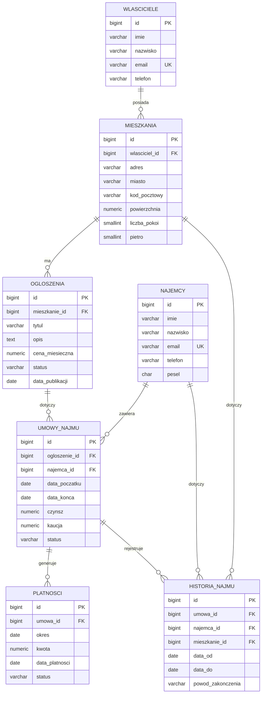

# Projekt logiczny i fizyczny — System Obsługi Wynajmu Mieszkań

> SEKCJA 2. Ten dokument „zamraża" model danych. Implementacja: `sql/01_schema/` i `sql/02_constraints/`.

## 1. Diagram ERD

Diagram w składni Mermaid (renderuje się na GitHubie i w wielu edytorach Markdown). Edytuj wg ostatecznego modelu.

## 2. Model logiczny

_(do uzupełnienia — opis każdej encji, jej atrybutów, dziedzin i relacji w formie zdaniowej. Tabela atrybut→typ→opis→ograniczenia)_

## 3. Normalizacja do 3NF (wymóg na 4.5)

Uzasadnienie musi być wprost — to jeden z punktów ocenianych na 4.5.

### 1NF
Każda kolumna przechowuje wartości atomowe; brak grup powtarzalnych i list w jednej komórce. _(opisz na przykładzie 1–2 tabel)_

### 2NF
Wszystkie klucze główne są pojedyncze (`id`), więc nie występuje częściowa zależność od części klucza złożonego. Każdy atrybut zależy od całego klucza. _(opisz)_

### 3NF
Brak zależności przechodnich — żaden atrybut niekluczowy nie zależy od innego atrybutu niekluczowego.
- Przykład decyzji projektowej: dane właściciela nie są powielane w `mieszkania`, lecz trzymane w `wlasciciele` i wiązane przez `wlasciciel_id` (eliminacja zależności przechodniej miasto/adres właściciela → mieszkanie).
- Przykład: kwota czynszu w `platnosci` wynika z umowy, ale jest utrwalana per okres celowo (czynsz może się zmieniać w czasie) — udokumentuj to jako świadomą decyzję, nie naruszenie 3NF.

_(rozpisz dla każdej tabeli — wystarczy 1–2 zdania na tabelę)_

## 4. Decyzje projektowe

_(do uzupełnienia — np. dlaczego osobna tabela historia_najmu, dlaczego status jako VARCHAR+CHECK zamiast ENUM, itp.)_
