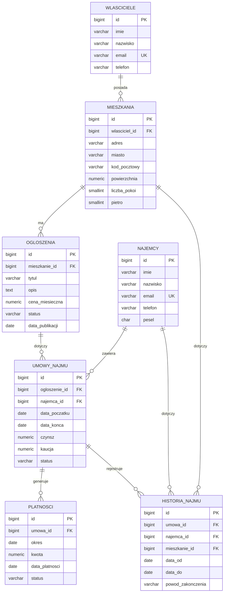

# Projekt logiczny i fizyczny — System Obsługi Wynajmu Mieszkań

> SEKCJA 2. Ten dokument „zamraża" model danych. Implementacja: `sql/01_schema/01_tables.sql` (tabele) i `sql/02_constraints/01_constraints.sql` (więzy).

## 1. Diagram ERD

Diagram w składni Mermaid (renderuje się na GitHubie i w wielu edytorach Markdown).

## 2. Model logiczny

Model wywodzi się bezpośrednio z encji i relacji z analizy wymagań (sekcja 1, p. 7). Poniżej pełna specyfikacja atrybutów każdej tabeli wraz z dziedzinami i ograniczeniami.

### najemcy
Profile osób wynajmujących mieszkania.

| Atrybut | Typ | Ograniczenia | Opis |
|---------|-----|--------------|------|
| id | BIGINT | PK, IDENTITY | klucz sztuczny |
| imie | VARCHAR(60) | NOT NULL | imię |
| nazwisko | VARCHAR(80) | NOT NULL | nazwisko |
| email | VARCHAR(120) | NOT NULL, UNIQUE | adres kontaktowy, identyfikuje najemcę biznesowo |
| telefon | VARCHAR(20) | — | numer telefonu |
| pesel | CHAR(11) | — | numer PESEL (stała długość) |
| utworzono | TIMESTAMPTZ | NOT NULL, DEFAULT now() | znacznik utworzenia |
| zmodyfikowano | TIMESTAMPTZ | NOT NULL, DEFAULT now() | znacznik modyfikacji (wyzwalacz) |

### wlasciciele
Właściciele mieszkań, w imieniu których działa biuro.

| Atrybut | Typ | Ograniczenia | Opis |
|---------|-----|--------------|------|
| id | BIGINT | PK, IDENTITY | klucz sztuczny |
| imie | VARCHAR(60) | NOT NULL | imię |
| nazwisko | VARCHAR(80) | NOT NULL | nazwisko |
| email | VARCHAR(120) | NOT NULL, UNIQUE | adres kontaktowy |
| telefon | VARCHAR(20) | — | numer telefonu |
| utworzono | TIMESTAMPTZ | NOT NULL, DEFAULT now() | znacznik utworzenia |
| zmodyfikowano | TIMESTAMPTZ | NOT NULL, DEFAULT now() | znacznik modyfikacji |

### mieszkania
Nieruchomości przypisane do właścicieli.

| Atrybut | Typ | Ograniczenia | Opis |
|---------|-----|--------------|------|
| id | BIGINT | PK, IDENTITY | klucz sztuczny |
| wlasciciel_id | BIGINT | NOT NULL, FK → wlasciciele | właściciel mieszkania |
| adres | VARCHAR(200) | NOT NULL | adres (ulica, numer) |
| miasto | VARCHAR(80) | NOT NULL | miasto |
| kod_pocztowy | VARCHAR(10) | — | kod pocztowy |
| powierzchnia | NUMERIC(6,2) | NOT NULL, CHECK > 0 | powierzchnia w m² |
| liczba_pokoi | SMALLINT | NOT NULL, CHECK > 0 | liczba pokoi |
| pietro | SMALLINT | — | piętro |
| utworzono | TIMESTAMPTZ | NOT NULL, DEFAULT now() | znacznik utworzenia |
| zmodyfikowano | TIMESTAMPTZ | NOT NULL, DEFAULT now() | znacznik modyfikacji |

### ogloszenia
Oferty wynajmu konkretnego mieszkania.

| Atrybut | Typ | Ograniczenia | Opis |
|---------|-----|--------------|------|
| id | BIGINT | PK, IDENTITY | klucz sztuczny |
| mieszkanie_id | BIGINT | NOT NULL, FK → mieszkania | mieszkanie objęte ofertą |
| tytul | VARCHAR(150) | NOT NULL | tytuł ogłoszenia |
| opis | TEXT | — | opis oferty |
| cena_miesieczna | NUMERIC(12,2) | NOT NULL, CHECK ≥ 0 | proponowana cena najmu |
| status | VARCHAR(20) | NOT NULL, CHECK, DEFAULT 'aktywne' | aktywne / zarezerwowane / zakończone |
| data_publikacji | DATE | NOT NULL, DEFAULT CURRENT_DATE | data wystawienia |
| utworzono | TIMESTAMPTZ | NOT NULL, DEFAULT now() | znacznik utworzenia |
| zmodyfikowano | TIMESTAMPTZ | NOT NULL, DEFAULT now() | znacznik modyfikacji |

### umowy_najmu
Zawarte umowy między najemcą a właścicielem (przez ogłoszenie).

| Atrybut | Typ | Ograniczenia | Opis |
|---------|-----|--------------|------|
| id | BIGINT | PK, IDENTITY | klucz sztuczny |
| ogloszenie_id | BIGINT | NOT NULL, FK → ogloszenia | ogłoszenie, którego dotyczy umowa |
| najemca_id | BIGINT | NOT NULL, FK → najemcy | strona umowy |
| data_poczatku | DATE | NOT NULL | początek najmu |
| data_konca | DATE | NOT NULL, CHECK > data_poczatku | koniec najmu |
| czynsz | NUMERIC(12,2) | NOT NULL, CHECK ≥ 0 | ustalony czynsz miesięczny |
| kaucja | NUMERIC(12,2) | NOT NULL, CHECK ≥ 0, DEFAULT 0 | kaucja zwrotna |
| status | VARCHAR(20) | NOT NULL, CHECK, DEFAULT 'aktywna' | aktywna / zakończona / rozwiązana |
| utworzono | TIMESTAMPTZ | NOT NULL, DEFAULT now() | znacznik utworzenia |
| zmodyfikowano | TIMESTAMPTZ | NOT NULL, DEFAULT now() | znacznik modyfikacji |

### platnosci
Miesięczne należności powiązane z umową.

| Atrybut | Typ | Ograniczenia | Opis |
|---------|-----|--------------|------|
| id | BIGINT | PK, IDENTITY | klucz sztuczny |
| umowa_id | BIGINT | NOT NULL, FK → umowy_najmu | umowa, której dotyczy płatność |
| okres | DATE | NOT NULL, UNIQUE(umowa_id, okres) | miesiąc należności (1. dzień miesiąca) |
| kwota | NUMERIC(12,2) | NOT NULL, CHECK ≥ 0 | kwota należna |
| data_platnosci | DATE | — | data opłacenia (NULL = nieopłacona) |
| status | VARCHAR(20) | NOT NULL, CHECK, DEFAULT 'oczekujaca' | oczekująca / opłacona / zaległa |
| utworzono | TIMESTAMPTZ | NOT NULL, DEFAULT now() | znacznik utworzenia |
| zmodyfikowano | TIMESTAMPTZ | NOT NULL, DEFAULT now() | znacznik modyfikacji |

### historia_najmu
Rejestr trwających i zakończonych najmów.

| Atrybut | Typ | Ograniczenia | Opis |
|---------|-----|--------------|------|
| id | BIGINT | PK, IDENTITY | klucz sztuczny |
| umowa_id | BIGINT | NOT NULL, FK → umowy_najmu | powiązana umowa |
| najemca_id | BIGINT | NOT NULL, FK → najemcy | najemca |
| mieszkanie_id | BIGINT | NOT NULL, FK → mieszkania | mieszkanie |
| data_od | DATE | NOT NULL | początek najmu |
| data_do | DATE | — | koniec najmu (NULL = trwa) |
| powod_zakonczenia | VARCHAR(200) | — | powód zakończenia |
| utworzono | TIMESTAMPTZ | NOT NULL, DEFAULT now() | znacznik utworzenia |

## 3. Normalizacja do 3NF (wymóg na 4.5)

Uzasadnienie prowadzone tabela po tabeli. Dla każdej formy normalnej podajemy warunek i argument, że jest spełniony.

**Założenie wspólne:** każda tabela ma sztuczny klucz główny `id` (typu IDENTITY). Oznacza to, że klucz główny jest pojedynczym atrybutem, co ma istotne konsekwencje dla 2NF (patrz niżej).

### 1NF — atomowość i brak grup powtarzalnych

Warunek: każdy atrybut przechowuje pojedynczą, niepodzielną wartość; brak list i grup powtarzalnych w komórce; istnieje klucz identyfikujący wiersz.

- Wszystkie atrybuty we wszystkich siedmiu tabelach są skalarne (liczby, daty, krótkie łańcuchy, znaczniki czasu). Nie przechowujemy w jednej kolumnie wielu wartości — np. dane kontaktowe rozbite są na osobne `email` i `telefon`, adres na `adres`, `miasto`, `kod_pocztowy`.
- Świadoma decyzja: płatności nie są listą wewnątrz umowy, lecz osobnymi wierszami w `platnosci` — to klasyczne rozwiązanie eliminujące grupę powtarzalną. Dzięki temu jedna umowa może mieć dowolnie wiele płatności bez naruszania 1NF.
- Każda tabela ma `id` jako klucz, więc każdy wiersz jest jednoznacznie identyfikowalny.

Wniosek: wszystkie tabele spełniają 1NF.

### 2NF — brak częściowych zależności od klucza

Warunek: tabela jest w 1NF i żaden atrybut niekluczowy nie zależy od *części* klucza głównego. Częściowa zależność może wystąpić wyłącznie przy kluczu złożonym.

- W każdej tabeli klucz główny to pojedynczy atrybut `id`. Przy kluczu jednoatrybutowym częściowa zależność jest logicznie niemożliwa — nie ma „części" klucza, od której coś mogłoby zależeć.
- Potencjalne klucze naturalne złożone (np. para `umowa_id` + `okres` w `platnosci`, na którą nałożono UNIQUE) nie pełnią roli klucza głównego — pozostałe atrybuty (`kwota`, `status`, `data_platnosci`) zależą od całej tożsamości płatności (`id`), a nie od samego `umowa_id` ani samego `okres`.

Wniosek: wszystkie tabele spełniają 2NF.

### 3NF — brak zależności przechodnich

Warunek: tabela jest w 2NF i żaden atrybut niekluczowy nie zależy od innego atrybutu niekluczowego (brak zależności przechodniej klucz → atrybut A → atrybut B).

Analiza per tabela:

- **najemcy / wlasciciele:** atrybuty `imie`, `nazwisko`, `email`, `telefon`, `pesel` opisują wprost osobę identyfikowaną przez `id`. Żaden z nich nie wyznacza innego (np. nazwisko nie determinuje telefonu). Brak zależności przechodnich.
- **mieszkania:** `adres`, `miasto`, `kod_pocztowy`, `powierzchnia`, `liczba_pokoi`, `pietro` opisują nieruchomość zależną od `id`. Dane właściciela **nie są** powielane w tej tabeli — przechowujemy jedynie `wlasciciel_id`. Gdybyśmy trzymali tu `imie_wlasciciela`, powstałaby zależność przechodnia (`id` → `wlasciciel_id` → `imie_wlasciciela`); wyniesienie właściciela do osobnej tabeli ją eliminuje.

  Uwaga projektowa: para `kod_pocztowy` → `miasto` bywa traktowana jako zależność funkcyjna. W modelu pozostawiamy oba pola jako niezależne atrybuty adresu (kody w PL nie zawsze jednoznacznie wyznaczają miasto, a normalizowanie słownika kodów wykracza poza zakres systemu). Jest to udokumentowana, świadoma decyzja, nie przeoczenie.
- **ogloszenia:** `tytul`, `opis`, `cena_miesieczna`, `status`, `data_publikacji` zależą od `id` ogłoszenia. Dane mieszkania nie są kopiowane — jest tylko `mieszkanie_id`. Brak zależności przechodnich.
- **umowy_najmu:** `data_poczatku`, `data_konca`, `czynsz`, `kaucja`, `status` opisują umowę zależną od `id`. Powiązania trzymane jako `ogloszenie_id`, `najemca_id` (klucze obce), nie jako zdenormalizowane kopie. Brak zależności przechodnich.

  Decyzja: `czynsz` w umowie jest osobnym atrybutem, mimo że ogłoszenie ma `cena_miesieczna`. To nie jest redundancja — cena ogłoszenia to oferta, a czynsz to faktycznie wynegocjowana kwota w konkretnej umowie. Te wartości mogą się różnić i są niezależne semantycznie.
- **platnosci:** `kwota`, `data_platnosci`, `status` zależą od tożsamości płatności (`id`). `okres` współtworzy klucz naturalny, ale nie wyznacza pozostałych atrybutów. Brak zależności przechodnich.

  Decyzja: `kwota` jest utrwalana w każdej płatności zamiast wyliczana z `umowy_najmu.czynsz`. To celowe — czynsz w umowie może zostać zmieniony (aneks) w trakcie jej trwania, a płatności już naliczone muszą zachować kwotę historyczną. Utrwalenie kwoty per okres jest poprawne, bo wartość ta jest cechą zdarzenia płatności, nie kopią aktualnego czynszu.
- **historia_najmu:** `data_od`, `data_do`, `powod_zakonczenia` opisują wpis historyczny zależny od `id`. Klucze `umowa_id`, `najemca_id`, `mieszkanie_id` są obce. Brak zależności przechodnich.

  Decyzja: `najemca_id` i `mieszkanie_id` można wyprowadzić z `umowa_id` (przez ogłoszenie). Ich zdublowanie w historii jest świadomą, kontrolowaną denormalizacją podyktowaną charakterem tabeli archiwalnej: wpis historyczny musi pozostać czytelny i niezależny od ewentualnych zmian w umowie/ogłoszeniu. Zaznaczamy to jako wyjątek od czystej 3NF uzasadniony rolą tabeli (snapshot historyczny). Pozostałe sześć tabel jest w pełnej 3NF.

Wniosek: schemat operacyjny (sześć tabel) jest w 3NF; tabela `historia_najmu` zawiera świadomą, udokumentowaną denormalizację typową dla danych archiwalnych.

## 4. Decyzje projektowe

- **Klucze sztuczne (IDENTITY) zamiast naturalnych.** Stosujemy `id` jako klucz główny we wszystkich tabelach. Upraszcza to klucze obce, uniezależnia model od zmienności danych naturalnych (np. PESEL nie zawsze dostępny, e-mail może się zmienić) i wspiera 2NF (klucz jednoatrybutowy).
- **Statusy jako VARCHAR + CHECK zamiast typu ENUM.** CHECK z listą dozwolonych wartości jest przenośny między wersjami PostgreSQL i łatwy do rozszerzenia (`ALTER ... DROP/ADD CONSTRAINT`), podczas gdy modyfikacja typu ENUM jest bardziej kłopotliwa. Decyzja świadomie stawia na elastyczność.
- **Kwoty jako NUMERIC(12,2).** Pieniądze nigdy jako `FLOAT`/`REAL` — typy zmiennoprzecinkowe wprowadzają błędy zaokrągleń niedopuszczalne w rozliczeniach. `NUMERIC` daje dokładność dziesiętną.
- **TIMESTAMPTZ dla znaczników czasu.** Przechowywanie momentu z informacją o strefie czasowej jest bezpieczniejsze niż `TIMESTAMP` bez strefy.
- **Rozdzielenie struktury od więzów.** Definicje tabel (`01_schema`) oddzielono od kluczy obcych, CHECK i indeksów (`02_constraints`). Ułatwia to czytanie schematu i ewentualne ładowanie danych masowych przed włączeniem części więzów.
- **Reprezentacja okresu płatności jako DATE (1. dzień miesiąca).** Zamiast osobnych pól rok/miesiąc używamy jednej daty wskazującej miesiąc. Upraszcza sortowanie, porównania i UNIQUE(umowa_id, okres).
- **Indeksy na kluczach obcych.** Założone dla poprawności złączeń i czytelności modelu. Zaawansowana optymalizacja wydajności (analiza EXPLAIN, indeksy pod konkretne zapytania) należy do poziomu 5.0 i jest poza zakresem projektu.
